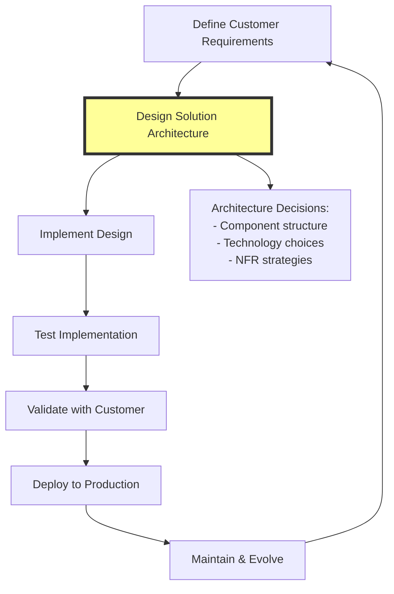
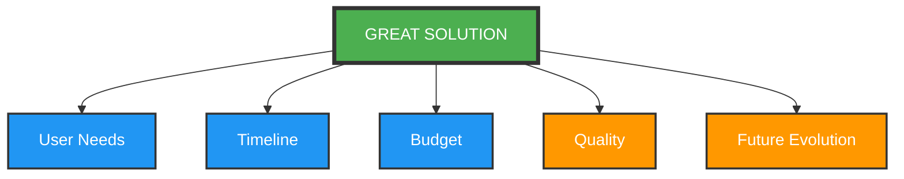
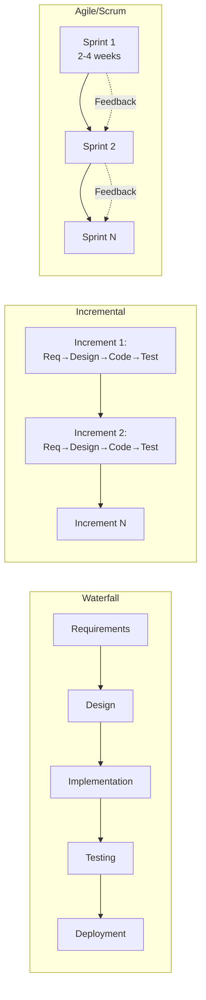
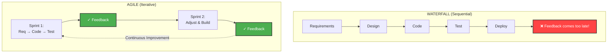
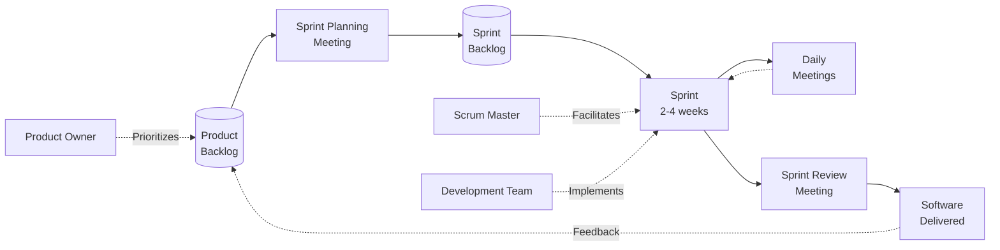
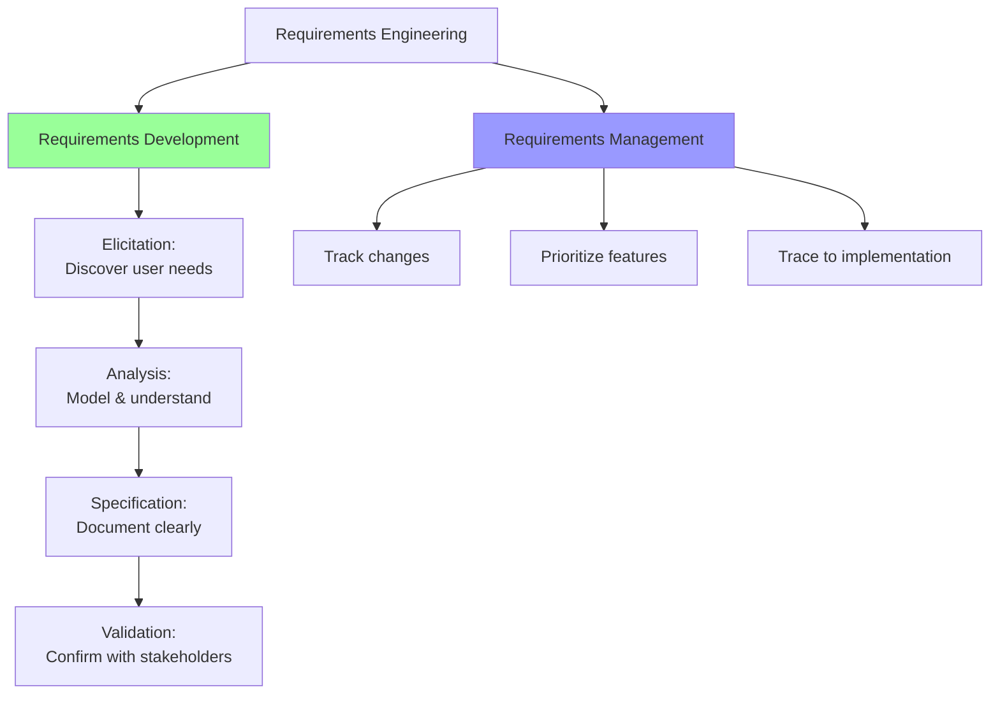
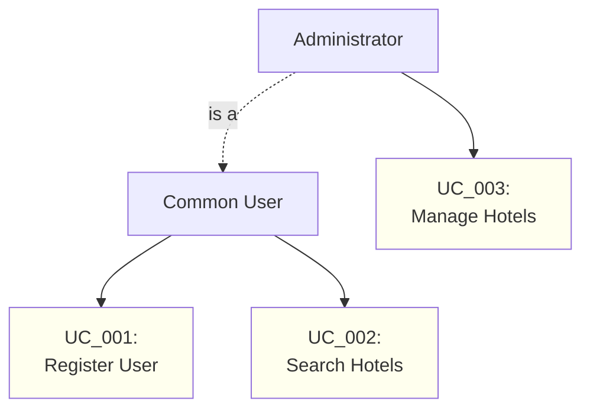

# Chapter 1 Mastery Guide: 

## Understanding The Importance Of Software Architecture

## Chapter Summary

Chapter 1 establishes the foundational understanding of what software architecture truly means in modern enterprise application development. The chapter positions the software architect as the bridge between business requirements and technical implementation, emphasizing that great solutions require not just modern tools (.NET 8, C# 12, Azure) but disciplined processes for gathering requirements, choosing development methodologies, and making architecture decisions that balance user needs, timelines, budget, quality, and future evolution. The chapter argues that sustainable software cannot exist without great software architecture, and introduces the real-world case study (WWTravelClub) that will demonstrate these principles throughout the book.

## Measurable Learning Objectives

By the end of this chapter, you will be able to:

1. **Define Software Architecture** and distinguish it from design and implementation, explaining how it ensures software meets requirements, timeline, budget, quality, and evolution constraints.
2. **Compare And Contrast Software Development Process Models** (Waterfall, Incremental, Agile, Lean, XP, Scrum, SAFe) and recommend appropriate models based on project context.
3. **Execute A Complete Requirements Engineering Process** including elicitation, analysis, specification, and validation using techniques like interviews, prototyping, use cases, and user stories.
4. **Identify And Articulate Non-Functional Requirements** (scalability, robustness, security, performance) and explain their architectural impact.
5. **Apply Design Thinking And Design Sprint** methodologies to discover real user needs and validate solutions through rapid prototyping.
6. **Create An Azure Account And Navigate The Azure Portal** to understand cloud-based architectural components.
7. **Diagnose Common Architectural Problems** (performance, incorrect implementation, poor usability) and propose solutions using requirements engineering and .NET 8 best practices.

**How Chapter 1 Sets The Stage**

This chapter provides the **Mental Framework** and **Vocabulary** for all subsequent technical chapters. Understanding requirements engineering enables you to make informed decisions in:

* **Domain-Driven Design** (Chapter 13): Identifying bounded contexts from user requirements.
* **Microservices** (Chapters 11, 15): Deciding when to split monoliths based on scalability requirements.
* **Performance Optimization** (Chapter 2): Translating performance requirements into measurable SLAs.
* **Cloud Architecture** (Chapters 10-12): Choosing Azure services based on robustness and scalability needs.
* **DevOps** (Chapter 8): Aligning CI/CD processes with chosen development methodologies.

**Key Question This Chapter Solves**

**"How Do I, As A Software Architect, Ensure That The Software Solution I Design Will Meet User Requirements, Be Delivered On Time And Within Budget, Maintain High Quality, And Support Sustainable Future Evolution?"**

**The answer**: Through disciplined requirements engineering, appropriate process model selection, and architecture decisions that explicitly address non-functional requirements.

## CONCEPT BREAKDOWN WITH VISUAL DIAGRAMS

## Concept A: What Is Software Architecture?

**ELI5 Explaination:**

Imagine you're building a house. The architect doesn't hammer nails or paint walls—they design the blueprint showing where rooms go, how plumbing connects, and ensuring the house won't collapse. A software architect does the same: they design how code pieces fit together so the application works well, can be changed later, and meets what users need.

**Technical Definition:**

Software architecture is the high-level structure of a software system that defines:
* **Components**: Major building blocks (services, modules, layers)
* **Relationships**: How components interact and depend on each other
* **Constraints**: Rules that ensure quality attributes (performance, security, scalability)
* **Decisions**: Trade-offs documented through Architecture Decision Records (ADRs)

The architect ensures implementation matches design, which matches requirements.

**Historical Context**

The term "software architecture" emerged in the **1960s** when computer scientists realized software development needed engineering discipline like building construction. Before this, software was often "code and fix"—leading to the **Software Crisis** where most projects failed.

Evolution Timeline:
* 1960s: Waterfall model (sequential phases)
* 1980s: Object-oriented design patterns
* 2001: Agile Manifesto (iterative development)
* 2010s: Microservices, cloud-native architectures
* 2020s: .NET unification (.NET 5+), cloud-first design

**Common Misconceptions**

| Misconception	                   | Reality                                  |
|----------------------------------|------------------------------------------|
| "Architecture is just diagrams"  | Architecture is **code structure, deployment decisions, and documented trade-offs**|
| "We don't need an architect for small projects" |	Even small projects benefit from **explicit quality attribute decisions** |
| "Architecture is done upfront, then frozen" |	Architecture **evolves** through continuous refinement |
| "The architect doesn't write code" |	Great architects **validate designs through code** |

**Visual Diagram: Software Development Lifecycle**



**Legend**:
* Yellow box: Architect's primary responsibility
* Arrows: Sequential flow (but iterative in agile)
* Dashed box: Architecture artifacts

**Walkthrough**:
1. Requirements define **What** the system must do
2. Architecture defines **How** the system will be structured to meet requirements
3. Implementation realizes the architecture in code
4. Testing validates correctness
5. Deployment makes it available to users
6. Maintenance addresses bugs and new requirements
7. **Critical**: Architecture decisions in step 2 enable or constrain all subsequent steps

**Diagram: Constraints On Great Solutions**



**Note**: Each constraint pulls in different directions. Architecture balances these forces.


## Concept B: Software Development Process Models

**ELI5 Explanation**

Different teams work in different ways. Some plan everything before starting (like building a bridge), others build a little, test it, then build more (like a chef tasting while cooking). Process models are recipes for how teams work together.

**Technical Definition**

A software development process model defines:
* **Phases**: Stages of work (requirements, design, coding, testing)
* **Sequencing**: Order and overlap of phases
* **Roles**: Who does what (developer, tester, product owner)
* **Artifacts**: Outputs (requirements doc, code, tests)
* **Feedback loops**: How learning from later phases informs earlier ones

**Comparison Diagram: Process Models**



**Detailed Comparison Table:**

| Model | When to Use | Strengths | Weaknesses | Architect's Role |
|-------|-------------|-----------|------------|------------------|
| **Waterfall** | Highly regulated domains (medical devices), fixed requirements | Clear milestones, extensive documentation | Late feedback, inflexible to change | Design complete architecture upfront |
| **Incremental** | Medium-sized projects with evolving requirements | Early user feedback, risk reduction | Can lack long-term vision | Design for extensibility |
| **Agile (XP, Scrum)** | Dynamic markets, frequent changes | Fast feedback, customer collaboration | Can neglect architecture | Continuous architecture refinement |
| **Lean** | Startups, MVP development | Waste elimination, fast delivery | May sacrifice quality for speed | Identify minimum viable architecture |
| **SAFe** | Large enterprises (100+ developers) | Scales agile, maintains alignment | Heavy process overhead | Enterprise-level architecture governance |

**Visual: Waterfall vs Agile Feedback Loops**



**Deep Dive: The Agile Manifesto (2001)**

The book emphasizes this critical text:

```
We value:
- Individuals and interactions over processes and tools
- Working software over comprehensive documentation
- Customer collaboration over contract negotiation
- Responding to change over following a plan

While there is value in the items on the right,
we value the items on the left more.
```

**Architect's Interpretation**:
* "Working software" doesn't mean no architecture — it means architecture that **Enables** working software.
* "Responding to change" requires architecture that **Supports** change (loose coupling, clear boundaries).
* "Individuals and interactions" means architects must **Communicate** decisions, not dictate from ivory towers.

**Scrum Process Diagram (from the book)**



**Key Roles**:
* **Product Owner**: Prioritizes features, represents user needs
* **Scrum Master**: Removes impediments, facilitates process
* **Development Team**: Implements features (includes architect!)

**Architect's Responsibilities in Scrum**:
* Participate in **Sprint Planning** to identify architecture work
* Define **Definition of Done** including architecture criteria
* Conduct **Architecture Reviews** during Sprint Review
* Maintain **Architecture Backlog** of technical debt


## Concept C: Requirements Engineering Process

**ELI5 Explanation**

Before building a treehouse, you ask: "How many kids will use it? How high should it be? Does it need a roof?" Requirements engineering is asking the right questions so you build what people actually need.

**Technical Definition**

Requirements engineering is a structured process to:
1. **Elicit**: Discover what users need (interviews, observation, questionnaires)
2. **Analyze**: Understand and model requirements (prototypes, use cases)
3. **Specify**: Document requirements clearly (functional and non-functional)
4. **Validate**: Confirm requirements with stakeholders (reviews, acceptance criteria)

Process Flow Diagram (from book Figure 1.7)



**Elicitation Techniques (with examples)**

| Technique | When to Use | Example | Architect's Focus |
|-----------|-------------|---------|------------------|
| **Imagination/Brainstorming** | You're domain expert | "As a travel booking system architect, I know users need multi-currency support" | Identify architectural patterns from experience |
| **Questionnaires** | Large user base, quantitative data | "How many concurrent users? Which browsers?" | Gather scalability/compatibility requirements |
| **Interviews** | Complex domain, qualitative insights | "Walk me through your order approval process" | Discover business rules and workflows |
| **Observation** | Existing manual process | Shadow a warehouse worker for a day | Identify performance bottlenecks and usability needs |
| **Prototyping** | Unclear UI/UX requirements | Mockup in Figma/Pencil Project | Validate user interface architecture |


**Use Case Diagram Example (from book Figure 1.8)**



**Use Case Specification Template:**
```
UC_002: Search Hotels
Actors: Common User
Preconditions: User is authenticated
Main Flow:
  1. User enters destination and dates
  2. System queries hotel database
  3. System displays results sorted by price
  4. User selects hotel to view details
Postconditions: Hotel details displayed
Non-functional: Response time < 2 seconds
```

#### Requirements Specification Best Practices

**Functional Requirement Format:**
```
GOOD: "The system shall allow a common user to register themselves."
BAD:  "A common user registers themselves." (present tense, unclear obligation)
```

**User Story Format** (Agile):
```
As a <user type>,
I want <feature>,
So that <business value>

Example:
As a hotel manager,
I want to update room availability in real-time,
So that overbooking is prevented and revenue is maximized.

Acceptance Criteria:
- Changes visible to all users within 5 seconds
- Concurrent updates handled without data loss
- Audit log of all changes maintained
```
